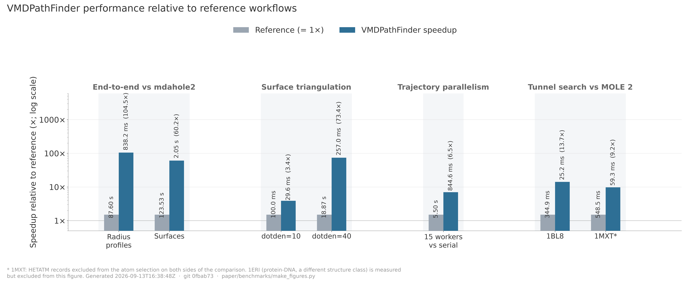

# Performance

Measured on an 8-core AMD Ryzen 7 7700X. Trajectory comparisons use 15
VMDPathFinder workers against serial baselines. Results depend on the system,
settings, and hardware; repetition counts and build details are recorded with
each benchmark.

| What | Compared with | Speedup |
|---|---|---|
| Surface triangulation (`sos_triangle`), same surface, byte-identical output | HOLE 2 `sos_triangle` | 3.4x at dot density 10, 73x at density 40 |
| HOLE pipeline on one structure (1BL8): search, dots, surface | HOLE 2 binaries built at -O2 | 5.3x circular, 7.6x Connolly |
| 50-frame trajectory, radius profiles | mdahole2 | 105x |
| 50-frame trajectory, radius profiles | serial HOLE shell loop | 7.0x |
| 50-frame trajectory, surface generation | mdahole2 | 60x (marching cubes: 97x) |
| 50-frame trajectory, surface generation | serial HOLE shell loop | 20x (marching cubes: 32x) |
| Job pool, 15 workers on 8 cores | 1 worker | 6.5x |
| Pore search step, Nelder-Mead (27,660 atoms) | HOLE's Monte Carlo search | 3.3x on 8 threads, 1.45x on one |
| Surface step, marching cubes | `sph_process` + `sos_triangle` | 4.0x on 8 threads, 1.5x on one |
| Tunnel search (MOLE 2 algorithm), matching tunnel counts | MOLE 2 | 8.9x to 15x |
| Tunnel search, compiled engine | the plugin's Tcl fallback | 173x to 231x |
| Cross-frame tunnel clustering, 1837 pathways | the plugin's Tcl fallback | 28x |

Choosing between the two surface builders, on one Connolly frame of a 197k-atom
channel (45,000 dots):

| Builder | Time | Triangles |
|---|---|---|
| Marching cubes, Connolly grid 1.4 Å | 0.24 s | 44,000 |
| `sph_process` + `sos_triangle`, dot density 15 | 1.10 s | 103,000 |

The marching-cubes mesher threads across cores (1.37 s on one core, 0.24 s on
eight) and is the default. Under `sos_triangle`, playback draws every 4th
triangle by default: drawing all of them costs 475 ms a frame against 94 ms,
and the frame at rest is always full detail. Marching cubes draws the full mesh
during playback.

HOLE comparisons use locally rebuilt `-O2` binaries. Surface-generation timings
exclude interactive display. The step rows time one engine call on one frame;
in the 15-worker trajectory pool each job runs single-threaded and fixed
per-frame costs dominate, so marching cubes gains 1.6x there and the
Nelder-Mead search none. Profiles from the two searches agree to Monte Carlo
noise (identical minimum radius, 0.06 A rms). Matching tunnel counts do not establish identical
route geometry; tetrahedron counts differ on some test structures.

  

[Benchmark records and reproduction instructions](https://github.com/aminkvh/VMDPathFinder/blob/main/paper/README.md).
